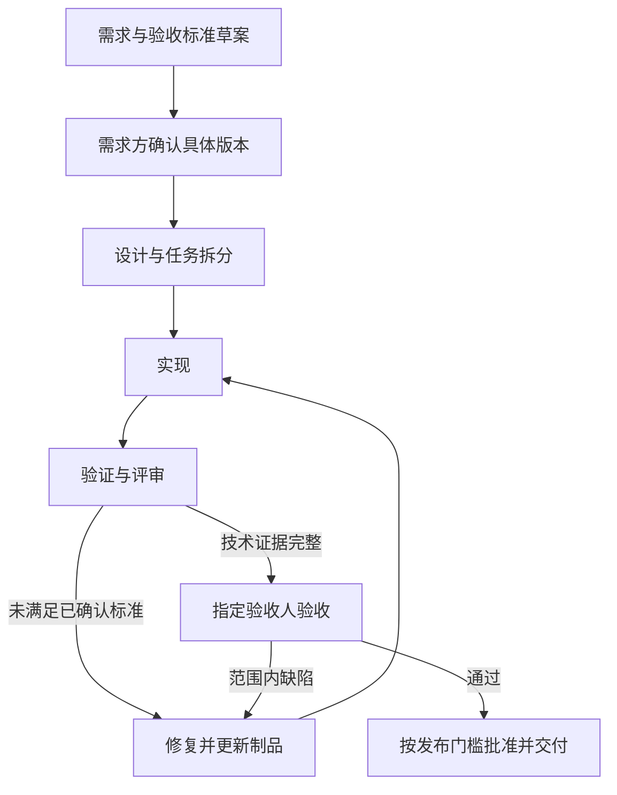

# WQT 贡献与交付流程

WQT 采用 artifact-driven development。需求、设计、代码、验证和验收都是可追踪制品，团队通过 GitHub 协作。聊天用于讨论与确认，仓库制品用于持续执行和交接。

## 1. 责任分工

| 角色 | 责任 |
|---|---|
| 需求提出方 / 产品负责人 | 确认目标、范围、优先级、非目标与验收标准；确认需求变更 |
| 技术负责人 | 明确技术边界、方案、迁移与风险，组织工程验证和技术放行 |
| 开发者 / 编码代理 | 在已确认范围内实现、验证、修复、维护制品与追踪关系 |
| 评审人 | 检查实现、测试与需求是否一致，记录待改项 |
| 指定验收人 | 对指定版本进行产品与体验验收，记录通过或不通过 |
| 发布负责人 | 按发布批准执行合并、部署、迁移、冒烟与必要回退 |

一人可兼任角色，但自动化执行结果不代替所需的人工验收。vNext 具体人员及 Gate 0–4 以[受控基线](docs/vnext-requirements-and-acceptance.md)为准；本流程不重置其范围、批准人或门槛。

## 2. 最小制品集合

| 制品 | 最少包含 | 放置方式 |
|---|---|---|
| 需求与验收标准 | 来源、目标、范围、非目标、验收 ID、确认记录 | 复用版本基线；小变更可用变更记录 |
| 设计与任务 | 方案、影响、数据/权限边界、步骤、风险与回退 | 变更记录；重要架构引用独立设计或决策记录 |
| 实现 | 代码、必要迁移和测试 | 同一需求关联的 Git 提交与 PR |
| 验证证据 | 验收 ID、环境、命令、版本、结果、失败与限制 | 变更记录或现有版本证据目录 |
| 验收与发布记录 | 版本、验收人、结论、未关闭问题；发布时增加迁移与回退版本 | 复用版本 UAT / RELEASE 制品 |

默认使用 `npm run change:new -- WQT-002 short-topic` 创建 `docs/changes/WQT-002-short-topic/` 的 spec、plan、evidence。小变更使用[单文件模板](docs/development/change-template.md)，无需为每个步骤创建独立文档。编号必须唯一；详见[制品入口](docs/changes/README.md)。vNext 已规定的制品路径和需求 ID 继续沿用，不另外建立冲突标准。模板中的“待确认”不是批准。

二进制、大体积或敏感证据可保存在受控外部位置，仓库记录访问位置、版本或摘要及对应提交，不提交密钥和原始个人数据。

## 3. 开发循环与人工节点

需求与验收标准已在任务或基线中明确确认时，直接进入执行；本次明确要求的文档整理属于已授权工作，不再为低风险实现细节增加审批。

自动循环每轮执行：

1. 读取已确认制品、当前代码与上轮失败证据，选择下一项可执行任务。
2. 实现最小完整变更，运行适当检查，评审与验收标准的差距。
3. 失败则定位根因、修复并重验受影响部分；成功则更新追踪记录并继续剩余任务。
4. 技术标准满足后提交验收材料，标记“待验收”；不能自行写成“用户验收通过”。

需求、验收标准或数据/权限等高后果边界变化时，先更新影响与差异，交相应负责人确认。不得为让现有实现通过而降低标准。阻塞记录须可供下一位成员恢复；不得无新证据反复重跑失败步骤。

“自动循环”是项目执行规则。常驻 agent、定时任务、自动合并和自动部署需要各自的配置与授权，不能从本文件推断已经启用。

## 4. GitHub 版本管理

- 用 Issue 或已存在任务标识关联需求与制品；状态由实际证据更新。
- 开发分支默认 `codex/<简短主题>`，遵循团队明确指定的分支命名；避免无关改动混入同一 PR。
- 提交说明关联任务或需求 ID，清楚描述变更目的。设计与实现一起演进，提交后记录对应 SHA；尚未提交时标为工作区证据。
- PR 使用仓库模板，链接需求、验收标准、方案、测试证据、迁移与回退说明。
- 评审意见回到修复循环。涉及行为变化时给出具体前后场景；技术检查通过不代替指定人员验收。
- 合并与发布遵循任务授权及版本门槛；未授权时完成本地可审阅结果，不自动向外发布。不得强推共享分支或覆盖他人工作。
- 发布记录绑定实际提交/标签、部署环境、迁移版本、验证结果与回退版本。

PR 配置 Artifact checks 工作流，执行 `npm run test:artifacts` 和 `npm run check:artifacts`，不安装业务依赖、不连接数据库。检查结构不校验业务真伪，也不证明分支保护或必需评审已经配置。每次变更的实际 CI 结果记录在 evidence。

## 5. 完成标准

| 状态 | 判定依据 |
|---|---|
| 需求已确认 | 需求方对具体范围及验收标准有明确确认记录 |
| 实现完成 | 代码、必要测试、迁移和文档齐备 |
| 验证通过 | 每项技术验收标准有可重复证据，失败和限制已记录 |
| 验收通过 | 指定验收人对明确版本给出结论 |
| 已交付 | 该变更要求的合并/发布完成，记录版本与交付验证 |

文档整理可不涉及运行发布，但仍需检查事实、链接和制品完整性。不能把“待验收”或“本地完成”标成生产交付。

## 6. 需求追踪

保持一条可导航的关系：**需求 ID → 设计/任务 → PR/提交 → 测试证据 → 验收版本**。测试不适用时说明原因，不能简单留空。版本基线已有追踪表时直接复用。

发现新需求先记录来源与影响，确认后再纳入；发现缺陷记录复现、根因、修复与回归证据。新任务接手先读制品状态，不依赖某位成员的个人记忆。
