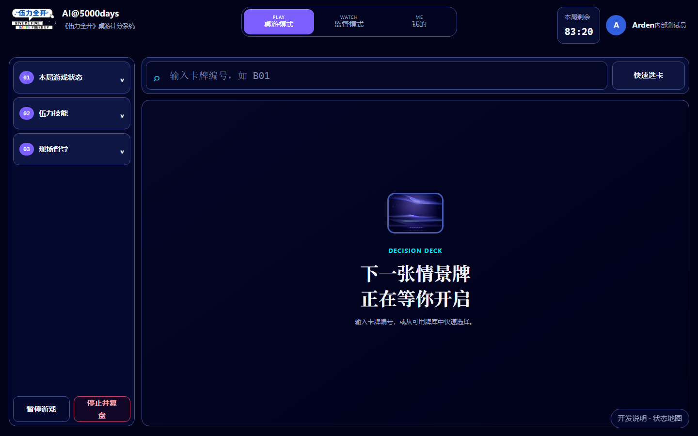
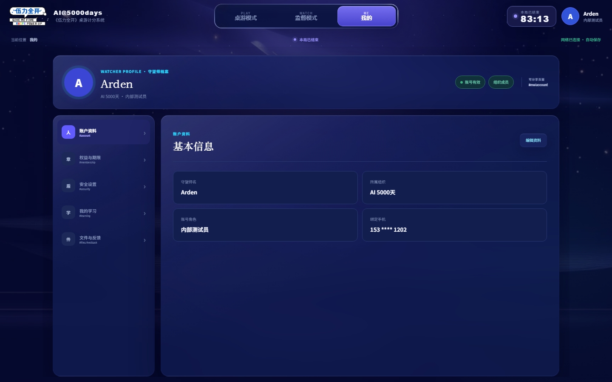

# 伍力全开原型设计 Spec · 已确认设计基线

版本：2026-09-12 / D2。用户已确认第 9 节三项设计决策。本文是下一轮实现基线，不是现状描述或完成声明。

## 0. 依据与优先级

1. 用户确认的业务与本次纠正优先。
2. v4-baselines/prompts.json 与参考图定义视觉、左栏展开方式。
3. v4-prototype 的代码用于核对已经画出的元素，不默认其假数据/占位交互正确。
4. 现有 public/supervisor-controller.js、public/my.html、public/game-review.js 用于补齐真实功能清单；不是已核实的线上截图。

发现的冲突：v4 可执行原型中 top-watch/top-me 只弹 toast，没有完整页面；它不能证明这两页已实现。v4 文案还有“实践力/共情力”等旧名称，五维统一为安全力、脑波力、实感力、创心力、沟通力；技能字母和属性的对应关系必须另行核查，不照抄旧映射。

## 1. 不再变动的产品边界

- 唯一账号操作者是守望者；其他玩家在线下讨论和选择，不操作电脑。
- 一个活动可开展多局；一次新游戏到完成是一局。
- 新游戏第一步直接选择已有活动；活动码仅展示五位英文字母，不作为前置门槛。
- 第二步查看活动已有配置，只分配三个阶段的卡牌数量，不选具体卡牌、不自行重建活动模式。
- 进入游戏后选择卡牌、获取反馈。具体效果来自卡牌数据，不编造统一反馈/分值。
- 复盘沿用现有完整链路，选择历史或 JSON 导出不等于复盘报告。

## 2. 三个一级 Tab：壳层必须分开

| 一级导航 | 页面主体 | 桌游左栏 | 卡牌输入条 |
|---|---|---|---|
| 桌游模式 | 现场计分与卡牌反馈 | 有且仅有一组 | 有 |
| 监督模式 | 雷达图、游戏状态、属性控制、操作历史 | **不渲染** | **不渲染** |
| 我的 | 账号、权益、安全、学习、活动、文件反馈 | **不渲染** | **不渲染** |

顶部始终保留官方品牌、三 Tab、当前局状态和守望者身份。第三项必须叫“我的”，禁止改成“本局记录”。切换 Tab 只换视图，不能新建/结束局、清空选择或复制另一份计时器。切出桌游关闭临时面板，切回来恢复当前卡牌和选择。没有进行中对局时显示“未开始”，不伪造倒计时。

```text
桌游模式
┌ 官方品牌 ───── [桌游模式] [监督模式] [我的] ── 局状态 / 身份 ┐
│ 01 本局游戏状态 │ 卡牌编号输入                    选择卡牌 │
│ 02 伍力技能     ├───────────────────────────────────────┤
│ 03 现场督导     │ 空态 / 卡牌场景 / 选项 / 反馈           │
│                │                                       │
│ 暂停 / 停止复盘│                                       │
└────────────────┴───────────────────────────────────────┘

监督模式：无桌游左栏，不留原左栏占位
┌ 官方品牌 ───── [桌游模式] [监督模式] [我的] ── 局状态 / 身份 ┐
│ 伍力雷达图 + 游戏状态    │ 五维属性控制                   │
│                         │ 操作历史                      │
│                         │ 重置属性 / 导出数据           │
└─────────────────────────┴───────────────────────────────┘

我的：无桌游左栏；保留账号内部侧导航
┌ 官方品牌 ───── [桌游模式] [监督模式] [我的] ── 局状态 / 身份 ┐
│ 守望者档案：头像 / 名称 / 组织 / 账号有效状态             │
│ 账号功能导航  │ 当前账号功能内容                         │
└───────────────┴─────────────────────────────────────────┘
```

布局代码示意（约束示例，不是本次已改代码）：

```jsx
<AppShell header={<ProductHeader activeTab={tab} />}>
  {tab === 'game' && <GameLayout rail={<GameRail />}><CardWorkspace /></GameLayout>}
  {tab === 'watch' && <SupervisionPage session={session} />}
  {tab === 'me' && <AccountPage user={watcher} />}
</AppShell>
// GameRail 不能放在 AppShell 中：否则会污染另外两页。
// session 是三页共享的当前局，不随 Tab 切换创建。
```

## 3. 桌游左栏：以 v4 的内容和行为为准



图示用于确认布局，不认可图中固定时间/测试身份等演示数据。

基准 1440×900：沿用 v4 左栏约 260px、外侧 18px、栏间距 14px。顶部三个入口高约 66px，编号 01/02/03；底部暂停与停止操作固定。默认全部收起，不新增第四个入口或在栏内堆积正文。

| 元素 ID | 展开内容（必须有） | 行为 |
|---|---|---|
| R01 本局游戏状态 | 活动、当前卡牌/未读取、活动模式；启蒙期/成长期/青春期各自已完成数与配置总数、进度提示 | 从当前局读取，不写死 0/5；卡牌完成后更新 |
| R02 伍力技能 | 五条紧凑技能行：技能标识、正式名称、可用/冷却等状态、适用的操作入口 | 不得用“五维分值待核定”替代技能；名称、冷却和消耗以已有规则核实后绑定 |
| R03 现场督导 | 未开启/录音状态、波形区、权限说明、开始/停止录音、查看监督模式 | 录音是独立授权动作；拒绝权限须给可恢复状态，不能伪造录音成功 |
| R04 底部操作 | 暂停/恢复、停止并复盘 | 暂停锁定计时和游戏写入；停止确认后不可恢复正式计分 |

展开规则：一次仅一个侧向面板；再次点击当前入口关闭；切其他入口直接替换。沿 v4 从左栏右缘覆盖展示，约 310px 宽、内容内部滚动，**主卡牌区宽度不变**。Esc/关闭按钮可关闭并把焦点还给入口。打开选卡或全局确认前关闭侧向面板，禁止面板上再套业务面板。

```text
左栏固定 260       右侧主内容布局不变
┌──────────┐ ┌─────────────────────────────────────┐
│01 状态 × ├──── 浮层 310 ───┐                     │
│02 技能   │ 活动 / 卡 / 模式│    卡牌画布          │
│03 督导   │ 三阶段进度      │                     │
│          ├────────────────┘                     │
└──────────┘ └─────────────────────────────────────┘
```

## 4. 新游戏与卡牌区域

- 新游戏入口开启两步向导；第一步列表直接可见，有活动加载中、无可选活动、加载失败重试、已选中状态。
- 第二步活动摘要、只读配置字段、三个数量步进器、分配合计、上一步/开始本局同屏可见。总数校验依活动配置，不全局固定 9 张。
- 页头与底栏两步一致。删除 v5 新增的“守望者工作台”中间欢迎页；登录后直接进入桌游模式，新游戏从该页面开启。取消配置返回桌游页，不新增中间页。
- 卡牌区域按空态→读取中→读取失败/已读取→选择→反馈→本张完成呈现。最终卡也必须显示反馈，再进入结束状态。
- 选卡器只在游戏中存在；三阶段、筛选、卡牌列表使用真实关联数据，禁止换编号后仍显示同一张虚构场景。

## 5. 监督模式：功能页面，不是观察便签

来源：public/supervisor-controller.js 的 createSupervisorInterface、共享状态监听。

| 区域 | 必须展示/可操作 | 验收状态 |
|---|---|---|
| W01 伍力雷达图 | 五个真实属性轴、当前值；中心显示按现有属性计算规则得出的百分比分数；同一局数据联动 | 无局提示；有局正确渲染，不写死图形 |
| W02 游戏状态 | 未开始/进行/暂停/结束、当前阶段、剩余时间、完成卡牌数 | 与桌游页一致 |
| W03 伍力控制面板 | 五维名称与数值，现有增/减及输入控件 | 修改后雷达图、当前局同步；上下限按当前逻辑，不自造规则 |
| W04 操作历史 | 按现有数据展示操作及前后变化/时间（字段以源码为准） | 空态、长列表滚动、最新操作可见 |
| W05 页面操作 | 重置属性、导出数据 | 重置须明确影响范围并确认；导出内容与当前局一致 |

桌面采用页面内部两列信息布局，不是左导航栏。不要把 W01/W02 当成桌游左栏复用。录音入口位于现场督导，不以录音面板替换监督页。切换 Tab 默认不暂停当前局；若需要改变这一行为，必须先确认。

## 6. 我的：账号页面，不是本局复盘



已确认：该图的账号内部侧导航（账户资料等）保留；仅去掉 01/02/03 桌游三入口栏。不改成横向二级 Tab。

| 模块 | 信息与动作 | 来源/限制 |
|---|---|---|
| M01 守望者档案 | 头像、名称、组织、角色、账号有效状态 | 参考图；示例不展示真实个人信息 |
| M02 账户资料 | 名称、组织、绑定手机号掩码、编辑资料 | 当前 my.html；账号角色不擅自开放编辑 |
| M03 权益与期限 | 账号/组织有效期与状态 | 参考图与当前账号逻辑，非游戏剩余时间 |
| M04 安全设置 | 修改密码、校验、成功/错误状态、退出登录 | 现有 my.html；不在原型接真实认证 |
| M05 我的学习 | 现有守望学习内容及进度 | 复用现有链路；不改成卡牌选择历史 |
| M06 活动码/活动 | 申请活动、名称地点、申请状态、通过后可见码与复制；查询入口 | v4 prompts 与 my.html；示例码按五字母，旧 ACT-/WQT- 示例不沿用 |
| M07 活动记录 | 活动下游戏场次、查看对应记录/复盘入口 | 当前 my.html；记录必须绑定场次 |
| M08 文件与反馈 | 我的文件列表、空态、提交反馈 | 参考图及 my.html |

“我的”整体居中，参考宽约 1192px（1440 视口两侧各约124px），顶部档案横贯内容宽度；无桌游读卡条、暂停/停止按钮和三入口栏。账号内部侧导航固定为：账户资料、权益与期限、安全设置、我的学习、活动码、文件与反馈。M07 活动记录归入“活动码”所承载的活动模块，不新增一级 Tab。

## 7. 视觉与层级约束

- 保留官方 Logo、小伍 IP、深靛背景与蓝紫主按钮，青色仅强调交互；不另起视觉主题。
- 参考色来自 v4 prompts：背景 #050824，面板 #111B48/#172557，正文 #F4F6FF，主操作 #625BFF，高亮 #2BD9FF。
- 内容层为高不透明度面板；透明光效只用于外壳边缘。卡牌保留原蓝→暖金电路背景。
- 使用共享 Header、按钮、数量步进器，但不能因为共用组件就共用错误页面布局。
- 每屏一个主要内容层。侧向展开、选卡、确认不会同时堆叠。正文与列表在自己的区域滚动，避免多层整页滚动条。
- 1440×900 为截图基准；窄屏可单列/收纳，但禁止把桌游左栏带入监督/我的。

## 8. 验收清单（每条需截图或操作证据）

| ID | 验收项 | 证据 |
|---|---|---|
| A01 | 桌游/监督/我的三个 Tab 名称和选中态正确 | 三页全屏截图 |
| A02 | 监督、我的没有 GameRail，主内容不留其空列 | 两页截图 + DOM 检查 |
| A03 | 桌游左栏顺序、底部操作与 v4 一致 | 默认截图 |
| A04 | 三面板内容齐全、互斥、覆盖不挤压画布 | 三张展开截图 + 主区宽度前后比较 |
| A05 | 监督雷达/状态/控制/历史/重置/导出均可见且有行为 | 交互脚本；不能只 toast |
| A06 | 我的不是本局记录页；保留账号侧导航，六项逐项可达，活动记录归入活动模块 | 每模块截图与操作说明 |
| A07 | Tab 往返保持同一局 ID、计时、卡牌与记录 | 状态断言 |
| A08 | 新游戏直接活动列表，下一页仅数量分配 | 两步截图与校验测试 |
| A09 | 结束锁定写入、最后一张反馈可见、复盘绑定本局 | 结束/复盘状态证据 |
| A10 | 未实现的后端能力明确标注演示，不伪造成功 | 权限/失败/未接入状态截图 |
| A11 | 登录后直接进入桌游页；新游戏、取消配置和结束后再开局均不经过新增中间欢迎页 | 路径测试与截图 |

## 9. 用户已确认的设计决策

1. “我的没有左栏”仅指没有桌游三入口栏；账号内部侧导航保留。
2. 删除新增“守望者工作台”中间页，桌游页作为登录后主界面。
3. 二级导航为账户资料、权益与期限、安全设置、我的学习、活动码、文件与反馈；活动记录归入活动模块。

本次更新只定稿 spec，未修改原型实现。后续按 A01–A11 实现和核对，不再以“按钮能点通”替代整个页面验收。技能映射、正式数据与服务规则仍按文中所述核查，不因设计确认而视为已实现。
