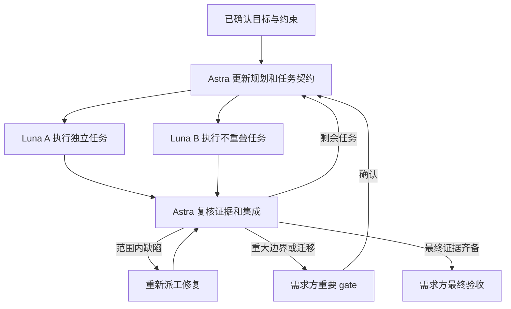

# Astra / Luna 子代理执行工作流

确认来源：2026-09-12 项目指令。目标可迁移；需求方只验收最终目标和重要 gate。日常任务分解、派工、技术检查与范围内修复由主控闭环。

## 1. 目标与状态的归属

| 制品 | 保存内容 | 更新责任 |
|---|---|---|
| spec.md | 最终目标、当前范围、约束、验收标准、已确认决策、目标变更记录 | Astra 主控 |
| plan.md | 依赖顺序、任务状态、文件归属、下一步动作、接续信息 | Astra 主控 |
| evidence.md | 子任务结果、检查版本、失败根因、修复记录、gate 与最终验收证据 | 主控汇总，Luna 提交事实 |

换会话或子代理时先读三份制品和当前 Git 状态，不依赖旧 agent 的记忆。记录实际模型与分支，不用角色名称冒充已切换模型。

阶段目标、任务分解和实现方法可依据证据调整，记录原因即可；最终目标、验收要求或高后果边界实质变化时进入重要 gate，不能静默降低标准。若需跨仓库转移，记录来源 SHA、差异和归属，不能仅复制一句目标。

## 2. 调度顺序

默认一个主控、最多两个 Luna 实现任务并行；只有文件与依赖均独立时增加并行度。读库配置、权限边界、事务和迁移设计由主控承担，不能作为“机械搬文件”委派。

主控保持可运行的集成顺序。代码提取任务可与测试用例编写并行，但测试运行必须等依赖实现和测试隔离就绪；不能为保持并行而各自发明不兼容接口。

## 3. 每次派工的契约

派工必须包含：任务 ID、目标与非目标、输入制品和基线 SHA、允许修改的文件、依赖/接口、验收 ID、实际验证命令、升级条件、返回格式。

子代理返回：修改列表、行为变化说明、执行过的检查、结果、未验证部分和阻塞。共享工作区内子代理不切换分支、不暂存或提交其他人的文件；提交与集成由主控管理。子代理默认不能继续委派，需主控明确分配权限。

状态使用：ready → running → review → done；失败进入 rework，缺少依赖进入 blocked。done 表示该任务经主控技术复核，不代表用户验收通过。

## 4. 重要 gate

| 节点 | 何时需要需求方 | 应提供的材料 |
|---|---|---|
| G-DOMAIN | 新增或改变领域、数据来源、权限、产品权益等重大边界 | 场景、选择、影响、迁移成本、建议 |
| G-MIGRATION | 存量归属歧义处理或会影响交付的迁移/切换方案 | 盘点、未知清单、演练、对账和回退 |
| G-FINAL | 最终目标与验收标准已有完整证据 | 可演示版本、测试映射、差异、遗留事项、验收结论入口 |
| 发布 | 任务涉及生产交付时，沿用版本发布门槛 | 原有版本基线要求的批准与证据 |

以上是本工作流的责任节点，不替代 vNext 的 Gate 0–4。已确认的 organization=tenant 和场次固定归创建组织不重复提问。代码任务分配、改名、提取、测试修复、局部技术通过不设置用户 gate。

## 5. 失败与恢复

- Luna 发现任务需要越过契约时返回证据；Astra 能在已批准边界内解决的直接处理，只有重要 gate 才交需求方。
- 同类失败没有新证据时停止机械重跑，改做定位实验或调整方案。
- 每个任务交接写明基线、当前差异、已通过项、未通过项、允许修改的文件和下一条可执行动作。不能仅写“继续上次工作”。
- 外部环境不可用时，继续静态分析或其他独立任务；模拟通过不能标记为真实 PG 集成通过。
- 合并和发布按已授权范围执行，自动循环本身不增加写入生产的权限。
