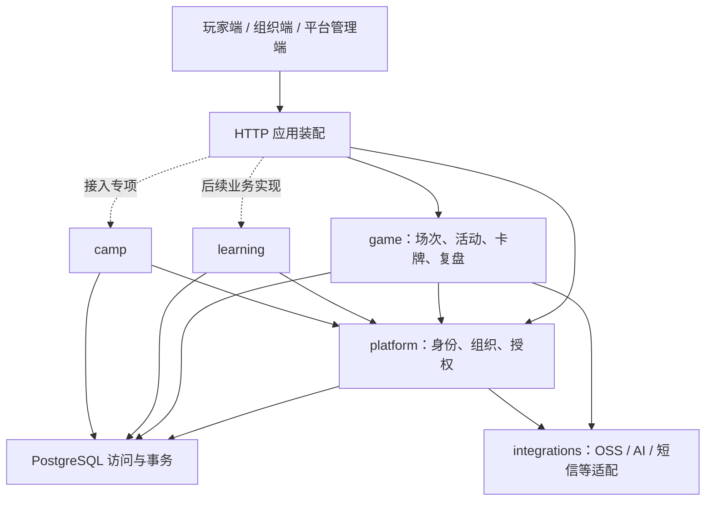

# WQT 应用架构与首轮重构方案

日期：2026-09-10。状态：organization 作为 tenant、场次固定归创建组织两项原则已获用户批准；其余为实施提案，尚未迁移数据库或改变权限行为。

## 已确认与本轮边界

用户已确认 organizations 作为 tenant。沿用 organizations.id，不新建 tenants 实体；enterprise_id 是现有组织外键名称，不代表另一种领域实体。API、JWT 和数据库旧字段先保持兼容。

产品目标是让 WQT 后端清晰承载平台公共能力、桌游、Learning 和后续创客营。当前约束为单机、一套 PostgreSQL；沿用 Express 模块化单体。目录拆分可以直接推进，历史场次固定归创建组织已获批准；个人履历、多组织成员、代理权限、独立产品权益仍属于需明确的数据或授权决策。

本轮架构建设不自动修改 docs/vnext-requirements-and-acceptance.md 的交付范围；Learning MVP 仍是该基线要求，创客营接入和代理销售系统不因预留模块边界而成为本轮实现任务。

## 代码证据与局限

- server.js 约 2,700 行，同时承担应用装配、组织、活动、场次、内容、上传和 AI 接口。首要问题是业务入口和依赖难以定位。
- src/middleware/auth.js 校验 JWT、当前会话和有效期；src/middleware/rbac.js 读取实时用户与组织。应继承这些行为，不能拆分时退回只信 JWT 中的角色或组织。
- server.js 的组织 dashboard、sessions 通过 users.enterprise_id 推导历史场次归属；成员 stats 返回此人的全部场次。人员转组织可能改变组织可见的历史数据。
- src/sql-pg.js 的查询入口使用 pool.query，尚未提供固定连接的事务 API。不能用多次池查询拼出可靠事务。
- 首次核查发现 AGENTS.md 的 SQLite/Streamlit 主体说明过时；现已更新。当前主库为 PG，Vue admin-web 为现行管理端。

以上是本地静态核查，不是生产审计、完整接口审计或运行验收。

## 目标模块及依赖

建议随实际迁移逐步形成以下结构，不批量创建空壳。当前目录、目标树及批次映射见[目录规范](architecture/repository-layout.md)；开发闭环见[贡献流程](../CONTRIBUTING.md)。

| 位置 | 职责及约束 |
|---|---|
| server.js | 进程启动、监听、关闭；不含业务 SQL |
| src/app.js | 中间件、路由和静态站点装配；可供测试创建应用而不监听端口 |
| src/platform/identity/ | 登录、会话、密码、个人账号；迁入已有认证实现 |
| src/platform/organizations/ | 组织、成员、邀请码、组织期限和名额 |
| src/platform/access/ | 身份到访问上下文的转换、角色与租户检查；不承载游戏规则 |
| src/game/sessions/ | 开局、事件、结算、历史记录、复盘的业务入口 |
| src/game/activities/ | 活动及场次关联；组织面板只是调用入口，不独占业务逻辑 |
| src/game/cards/ | 卡牌、版本、发布快照、卡牌组 |
| src/integrations/ | 外部 SDK、超时、错误转换；调用方先完成授权 |
| src/db.js、src/sql-pg.js | 先保留现有兼容入口；按实际事务需求演进 |

复杂用例可拆 route → service → repository：route 处理 HTTP，service 决定一次业务操作，repository 执行明确范围的 SQL。简单查询无需强制三层。模块仅导出需要的业务入口，不新增通用 BaseService、万能 repository、依赖注入容器或事件总线。

组织后台、平台后台是访问视角，不是各自复制一套活动、场次规则的理由。跨业务模块通过明确入口交互，不直接修改另一模块的表。

## 租户规则：确认部分与待决部分

已确认：一个 organization 就是一个 tenant。平台角色与租户身份分开理解；现有全局 role 字段本轮不直接迁移。现有单组织成员模式继续作为兼容起点。

已批准的历史归属规则（2026-09-10）：组织场次在创建时记录所属 organization；老师离开 A 加入 B 后，A 保留原场次，B 不因接收该老师而获得 A 的历史场次。这里的“永久归属”不等于无限期保留数据。个人能否继续查看旧组织明细需另定，不从“创建者是我”自动推导永久访问权。

迁移设计应明确区分组织数据、个人数据和历史归属未知数据。NULL 不得同时表示个人、公共和待核实。平台卡牌内容也不能通过“没有 organization_id”自动获得公共访问权限。

落实该规则需为 game_sessions 新增产生时归属字段，并约束 activity_sessions 的关联范围；具体列名、归属状态和约束 SQL 在实施设计时制定。新写入使用后端核实的实时组织上下文；旧数据结合活动、历史证据回填，歧义单列，不直接以人员今天的组织覆盖历史。

验收必须覆盖列表、详情、成员统计、看板、事件、结算、活动绑定、导出、文件和 AI 上下文。前端传入的 organization ID 只是请求参数，不能作为授权依据。平台跨租户访问单独授权和审计；代理关系不自动授予跨租户权限。

暂缓：多组织切换、代理层级授权、跨产品个人履历合并、独立产品权益表和 RLS。暂缓不代表放弃租户隔离；应用授权先闭环，再根据遗漏风险和运维能力决定第二道数据库防线。

## 实施顺序与完成证据

1. **建立行为基线。** 记录路由、HTTP 契约与中间件顺序；建立隔离测试数据库和外部依赖替身。导入应用不能自动连接生产或发送短信。校正当前技术栈说明。
2. **结构重构。** 先分离应用装配与进程启动，再逐模块提取组织、场次、活动和内容路由。保留 URL、响应结构、授权链和路由顺序。每次以同一用例验证提取前后成功与失败响应；权限缺陷另设变更，不藏在搬文件里。
3. **租户归属改造。** 历史规则已批准，先做只读归属盘点与迁移方案；新增兼容字段、新写入归属、存量分类回填、约束验证、读取切换分步执行。副本演练且歧义有处理结果后才发布。
4. **事务与重复提交。** 两人同时争最后一个名额时，单独查数量都可能通过；检查与占用必须在同一连接事务中锁定同一组织或等价原子操作。开局/结算断网重试则用稳定请求标识和唯一约束避免重复入账。分别增加并发与重试验收。
5. **交付验证。** 跑通登录→开局→选牌→结算→复盘→组织统计；A/B 两组织做反向读写测试。容量、故障恢复、告警和 Learning 验收继续按 vNext 基线组织，不能把重构测试等同于发布验收。

每步应可单独审阅和回退。代码回退不代表数据库回退；删除兼容字段之前必须证明旧版本不再需要它们。生产变更另行形成具体迁移、备份和回退材料。

## 本次评审结论

已收敛一个关键假设：organization 是唯一租户实体。新发现的必要约束是历史经营数据不能无意中依赖人员当前归属。尚未新增代码、测试或运行保证。

最值得理解的两点：模块边界解决“哪里负责这条业务规则”；租户边界解决“这条记录谁有权访问”。拆目录改善前者，持久化归属与全链路授权才落实后者。

决策记录：用户已确认“场次永久归创建时的组织”，无需重新确认同一原则。当前优先完成 README 与 AGENTS.md 的系统性整理；场次归属的代码、迁移与回归验证随后按本方案推进。离职个人的历史访问与存量归属歧义仍需分别处理。
